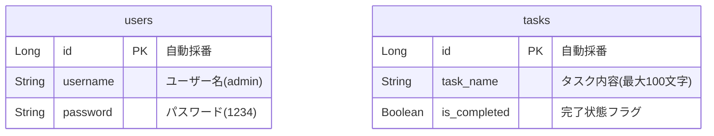

# MonoTask
  
〜「今やるべき1つの事」に全集中！目移りを遮断する業務着手支援システム〜

## 🏢 開発の背景・ターゲット層
現代のビジネスパーソンが抱える「マルチタスクによる集中力低下や、やることが多すぎて手が止まる」という課題を解決するために設計。あえてタスクを一覧で見せず、システム制御によって**「今やるべき1つのこと以外を完全に遮断する」**という逆転の発想を取り入れた、従業員の業務着手支援システムです。

## 🌐 アプリケーションのURL
ポートフォリオの実演デモ用URLは以下となります。
- **本番環境URL**: `http://localhost:5173/` （ローカル検証用環境）

### 🔐 テスト用アカウント
以下のデモ用認証情報をご入力ください。
- **ユーザー名（Username）**: `admin`
- **パスワード（Password）**: `1234`
※未ログイン状態でのタスク登録・取得画面への直接アクセスは、セキュリティ制御により完全遮断されます。
    

## ✨ 今回追加・強化した機能
1. **ユーザー認証（ログイン）機能（追加）**
   - セキュリティ要件を満たすため、初期画面にログイン機能を新規実装。
   - 動的な認証判定と、未入力時・認証失敗時のエラーメッセージ動的表示を実装。
  

2. **スマートフォン最適化（レスポンシブデザイン）（追加）**
   - 外出先や移動中のモバイル環境でも利用できるよう、画面幅600px以下を自動検知するメディアクエリを導入。
   - タスク登録フォームの「縦並び最適化」や、巨大表示フォントの「2.2rem自動縮小」により、文字はみ出しバグを100%防止。
  
     
     

3. **入力バリデーションの二重強化（変更）**
   - フロントエンド（React）とバックエンド（Spring Boot）の両面で、空白記述禁止・最大100文字制限の厳格なチェックを実装。
  

## 🛠️ 使用技術（技術スタック）

| カテゴリ | 技術スタック |
| :--- | :--- |
| **Frontend** | React (Vite) / JavaScript / レスポンシブCSS |
| **Backend** | Java / Spring Boot 3 / Spring Data JPA / Web API (JSON) |
| **Database** | H2 Database (MySQLモードによる高速インメモリ運用) |
| **Tool** | Git / GitHub / VS Code / IntelliJ IDEA |

## 📊 ER図（データベース設計）
バックエンドにおけるデータ構造 of 設計図です。ユーザー管理とタスク管理を独立したテーブルで論理的に設計しています。

## 🖥️ 画面・機能の説明

1. **ログイン画面**：アプリ起動時の初期画面。正規アカウント以外を遮断する認証セキュリティ要件をクリア。
  
2. **タスク登録画面**：頭の中の業務を箇条書きで一括登録する画面。スマホ表示時は片手で操作しやすいよう縦並びへ自動最適化。
     
    
3. **シングルタスク集中画面**：未完了タスクから「1つの事」を圧倒的巨大フォントで自動提示。全完了時は動的なお祝い演出を表示。
      
  
